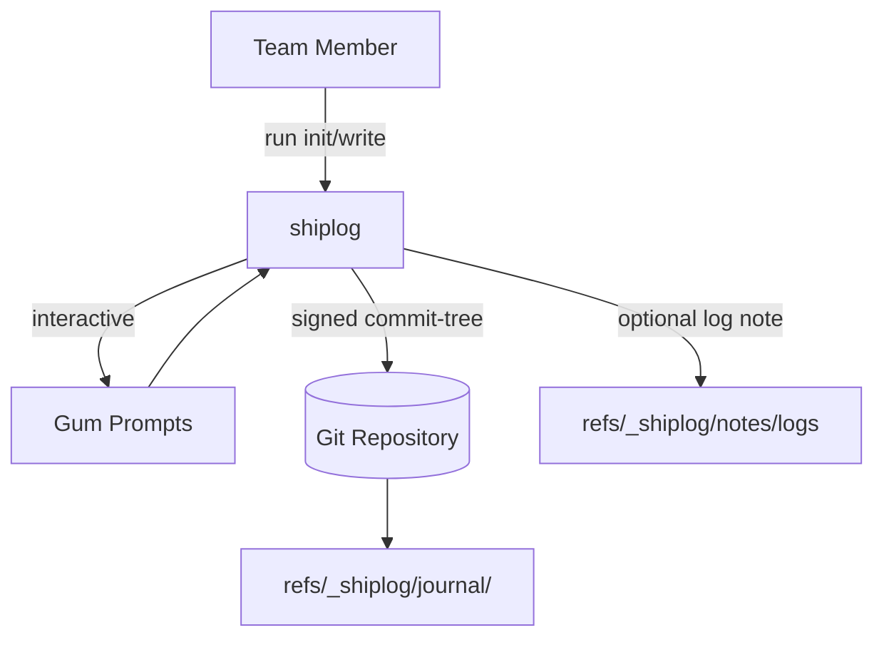
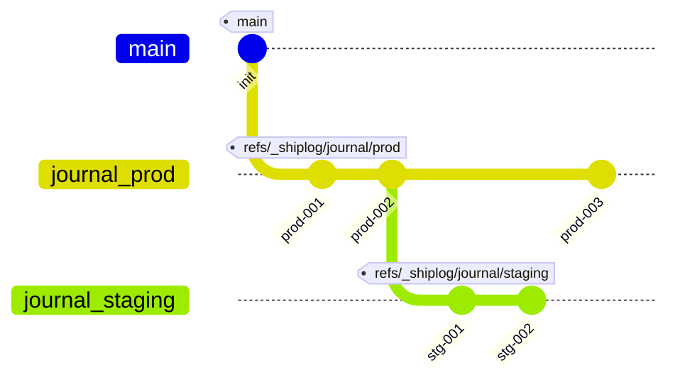
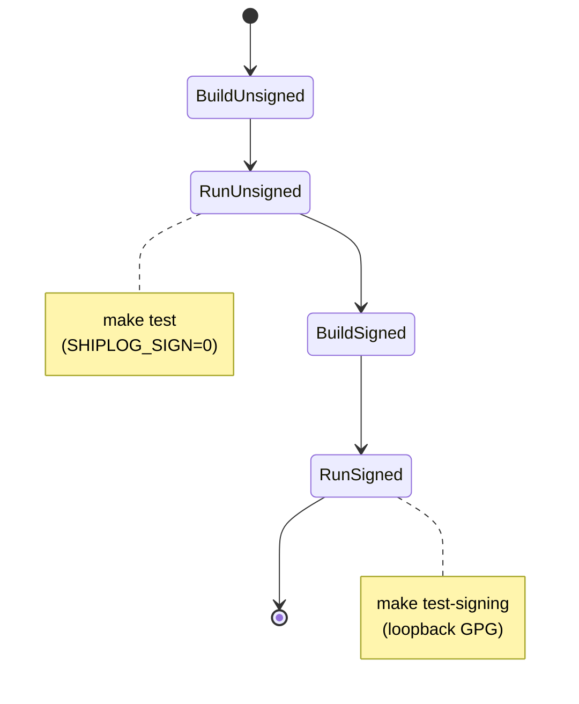

# SHIPLOG Lite

Record deployment events inside a Git repository. Entries are stored under hidden refs so they can be synced and audited without touching the main branch history.

## Requirements

- Bash 3.2+
- `git` with commit signing configured (GPG or SSH allowed signers)
- [`gum`](https://github.com/charmbracelet/gum) for interactive prompts (`--boring`/`SHIPLOG_BORING=1` skips it)
- [`jq`](https://jqlang.github.io/jq/) for JSON exports
- [`yq`](https://github.com/mikefarah/yq) for policy parsing (YAML)

## Features

- Hidden refs under `refs/_shiplog/journal/<env>` for append-only journals
- Signed empty-tree commits via `git commit-tree -S`
- Optimistic fast-forward updates using `git update-ref`
- Optional NDJSON log attachments stored at `refs/_shiplog/notes/logs`
- Local guardrails: author allowlist & signer precheck before creating entries
- Pretty `ls`, `show`, and `verify` flows powered by `gum`
- `--boring` / `SHIPLOG_BORING=1` mode for CI automation (no prompts, plain-text output)

## Architecture



## Git-Native Ship Log

Shiplog keeps records of who, what, where, when, why, and how deployments were made right in git, with the rest of your code. Shipit keeps a journal of deployment events, writing them to an append-only, immutable tree in the repo, `refs/_shiplog/journal/<env>`. 




## Quick Start

```bash
shiplog init
shiplog write
# Non-interactive (CI):
# SHIPLOG_BORING=1 shiplog write
# or shiplog --boring write
```

Use `SHIPLOG_ENV` to target a specific environment (defaults to `prod`).

## Installation

1. Clone the repository somewhere on your machine (for example, under `$HOME/.shiplog`):
   ```bash
   git clone https://github.com/flyingrobots/shiplog.git "$HOME/.shiplog"
   ```
2. Update your shell configuration (`~/.bashrc`, `~/.zshrc`, etc.) so the command is on `PATH`:
   ```bash
   export SHIPLOG_HOME="$HOME/.shiplog"
   export PATH="$SHIPLOG_HOME/bin:$PATH"
   ```
   Reload your shell (or `source` the file) and run `shiplog --help` to verify.
3. Optional but recommended: run the dependency installer once to ensure `gum`, `jq`, and `yq` are available:
   ```bash
   "$SHIPLOG_HOME/install-shiplog-deps.sh"
   ```

Prefer a one-liner? Use the bootstrap helper:

```bash
curl -fsSL https://raw.githubusercontent.com/flyingrobots/shiplog/main/scripts/install-shiplog.sh | bash
```
It clones into `~/.shiplog`, runs the dependency installer, and appends the necessary exports to your shell profile. Pass `--dry-run` or `--profile FILE` for finer control.

Those variables are no longer required at runtime—the CLI discovers its `lib/` directory automatically from the executable location—but keeping `SHIPLOG_HOME` exported makes downstream scripts (and documentation snippets) consistent.

## Tooling Helpers

- Dependency installer: `install-shiplog-deps.sh` installs `gum`, `jq`, and `yq` with `--dry-run` and `--silent` flags.
  ```bash
  chmod +x install-shiplog-deps.sh
  ./install-shiplog-deps.sh
  ```
- Docker sandbox: `shiplog-sandbox.sh` builds the local Dockerfile and drops you into `/workspace` with the repo mounted (git, gum, jq, yq, bats).
  ```bash
  ./shiplog-sandbox.sh            # build + interactive shell
  ./shiplog-sandbox.sh ./bin/shiplog ls prod 5
  ```
  Override the image tag with `SHIPLOG_SANDBOX_IMAGE`, and SSH agent forwarding is wired in when `SSH_AUTH_SOCK` is set.
- VS Code Dev Container: open the repository in VS Code and run “Dev Containers: Reopen in Container” to get a ready-to-go environment (`.devcontainer/` provisions gum, jq, yq, bats, etc.).

## Install Layout

The binary lives in `bin/shiplog` and dynamically resolves `lib/` relative to that path. Packaging scripts should place `bin/`, `lib/`, and `scripts/` together (for example, under `/opt/shiplog`). Setting `SHIPLOG_HOME` in your shell config is optional but convenient for downstream scripts.

## How to Configure Shiplog

Short answer: keep policy in Git, in a signed ref, and mirror it into the working tree so humans can review it.

- **Canonical policy ref** – store the enforced policy under `refs/_shiplog/policy/current`. The ref points at a signed commit whose tree contains `.shiplog/policy.yaml`.
- **Working copy mirror** – keep the same file (`./.shiplog/policy.yaml`) on your main branch so policy edits go through normal PR review.
- **Starter template** – copy `examples/policy.yaml` into `.shiplog/policy.yaml` when bootstrapping a repo.
- **CI publisher** – after merge, run `scripts/shiplog-sync-policy.sh` to publish the reviewed file to the policy ref (fast-forward only, signed by the bot key).
- **Local overrides** – developers can customise via Git config while iterating:
  ```bash
  git config shiplog.policy.allowedAuthors "deploy-bot@ci you@example.com"
  git config shiplog.policy.requireSigned true
  git config shiplog.policy.allowedSignersFile .git/allowed_signers
  ```
- **Resolution order (CLI + hooks)**
  1. `refs/_shiplog/policy/current` if present.
  2. `.shiplog/policy.yaml` in the working tree (warn: not enforced server-side).
  3. `git config shiplog.policy.*` fallback.
  4. `SHIPLOG_*` environment variables for sandboxes/tests.

### Example policy file

`.shiplog/policy.yaml` (mirrored exactly into `refs/_shiplog/policy/current`):

```yaml
version: 1
require_signed: true
allow_ssh_signers_file: ".git/allowed_signers"
authors:
  default_allowlist:
    - deploy-bot@ci
    - james@flyingrobots.dev
  env_overrides:
    prod:
      - deploy-bot@ci
      - james@flyingrobots.dev
wwwwwh_requirements:
  prod:
    require_ticket: true
    require_service: true
    require_where: [cluster, region, namespace]
  default:
    require_ticket: false
ff_only: true
notes_ref: "refs/_shiplog/notes"
journals_ref_prefix: "refs/_shiplog/journal/"
anchors_ref_prefix:  "refs/_shiplog/anchors/"
```

Roles and bindings can extend this schema later if you want to model release managers or staged access.

### Server-side enforcement

- Teach the pre-receive hook to read the policy ref directly. A sample implementation lives in `contrib/hooks/pre-receive.shiplog` (documented in `contrib/README.md`) – it parses the YAML, checks authors, and verifies signatures for `refs/_shiplog/journal/*` (and anchors).
- Keep reflogs enabled server-side (`core.logAllRefUpdates=true`) so policy moves and journal updates are traceable.
- Protect the policy ref with fast-forward only updates (`git update-ref` with optimistic old SHA) and signed commits.

### Publishing helper (CI)

`scripts/shiplog-sync-policy.sh` performs the plumbing steps required to push the reviewed file to the policy ref:

```bash
scripts/shiplog-sync-policy.sh          # uses commit-tree -S by default
SHIPLOG_POLICY_SIGN=0 scripts/shiplog-sync-policy.sh  # skip signing (not recommended)
git push origin refs/_shiplog/policy/current
```

Run this in CI after the PR merges so the policy ref stays the canonical source of truth.

Use `shiplog policy show` to inspect the resolved settings (add `--boring` to print plain text suitable for CI logs).

## Testing

- `make test` builds the dockerized Bats image with signing disabled and runs the suite locally.
- `make test-signing` builds with signing enabled (loopback GPG key) and runs the same tests against signed commits.
- GitHub Actions (`.github/workflows/ci.yml`) runs both variants on push and pull requests via Docker Buildx cache.
- To verify the pre-receive hook logic without touching a real remote, run `bats tests/11_pre_receive_hook.bats`; it spins up a throw-away bare repo, installs `contrib/hooks/pre-receive.shiplog`, and exercises the hook via local pushes.

The Bats suite under `tests/` currently covers:
- init wiring (`refspecs` + `reflogs`) and empty journal behavior.
- non-interactive write flow + `ls`/`show` rendering (human+JSON trailer).
- `export-json` NDJSON, Git notes attachment, and fast-forward-only guardrails.
- `verify` author allowlist logic (unsigned + signed matrix legs).
- default `show` and the dedicated signed-commit verification path.



## Environment Variables

- `SHIPLOG_ENV` – default environment for journal entries (default: `prod`).
- `SHIPLOG_AUTHOR_NAME` / `SHIPLOG_AUTHOR_EMAIL` – override author identity.
- `SHIPLOG_AUTHORS` – space-delimited allowlist; restricts authors permitted to append to the journal.
- `SHIPLOG_ALLOWED_SIGNERS` – path to SSH allowed signers file used during commit verification.
- `SHIPLOG_IMAGE` / `SHIPLOG_TAG` / `SHIPLOG_RUN_URL` / `SHIPLOG_LOG` – seed prompts for write flow and optional log attachments.
- `SHIPLOG_STATUS` – pre-select deployment status (defaults to `success` when interactive).
- `SHIPLOG_REF_ROOT` – override the ref namespace root (default: `refs/_shiplog`; set to e.g. `refs/shiplog` on Git builds that forbid dot-prefixed components).
- `SHIPLOG_NOTES_REF` – override the git-notes ref (default: `refs/_shiplog/notes/logs`).
- `SHIPLOG_SIGN` – set to `0`/`false` to skip commit signing (used in CI when no keys exist).
- `SHIPLOG_BORING` – set to `1` to disable gum UI globally (same as `--boring`).
- `SHIPLOG_ASSUME_YES` – set to `1` to auto-confirm prompts even when gum is available.
- `SHIPLOG_HOME` – point to a nonstandard installation directory (rarely needed if you cloned to `$HOME/.shiplog`).
- `SHIPLOG_LIB_DIR` – advanced override when `lib/` lives somewhere other than `$SHIPLOG_HOME/lib`.
- `SHIPLOG_POLICY_REF` – override the policy ref (default: `refs/_shiplog/policy/current`).
- `GUM` – path to the `gum` binary (default: `gum`).

## Project Layout

- `bin/shiplog` – entrypoint CLI sourcing the `lib/` helpers.
- `lib/` – bash modules (`common`, `git`, `policy`, `commands`).
- `scripts/` – plumbing helpers (e.g. `shiplog-sync-policy.sh`).
- `tests/` – Bats suite (interactive + boring modes) and fixtures.
- `install-shiplog-deps.sh` – cross-platform helper for installing gum, jq, yq.
- `shiplog-sandbox.sh` – Docker sandbox launcher (builds `Dockerfile`).
- `Dockerfile` – Debian-based sandbox with git, gum, jq, yq, bats preinstalled.
- `examples/policy.yaml` – starter policy file for `.shiplog/policy.yaml`.
- `contrib/README.md` – notes on hooks and CI helpers (`hooks/pre-receive.shiplog`).
- `.gitignore` – excludes local-only artifacts.

## License

This project is currently unlicensed. All rights reserved.

---

# 🚢 SHIPLOG

**Who shipped what, when, where, why, and how — signed and append-only.** 

SHIPLOG is your deployment black box recorder: a ledger built on Git.  
Every release leaves a receipt. No guesswork. No mystery deployments. Just truth you can prove.

## 🔍 Why SHIPLOG Exists

- Incidents = less “what changed?” scrambling  
- Audits = clean provenance for deploys  
- Compliance = cryptographic receipts  
- Team alignment = everyone knows exactly what happened  

---

## 🛠️ How It Works

- Hidden refs under `_shiplog`: `refs/_shiplog/journal/<env>` & `refs/_shiplog/anchors/<env>`  
- Each deploy produces a **signed**, **empty-tree commit** with human-readable header + optional JSON trailer  
- Fast-forward-only ref writes, no history rewriting  
- Optional logs attached via `git notes` (`refs/notes/_shiplog/logs`)  


# Clone or create your repo
git init my-project
cd my-project
git commit --allow-empty -m "init"

# Setup: if you used the bootstrap, `shiplog` is already on PATH; otherwise export SHIPLOG_HOME and add $SHIPLOG_HOME/bin

# Record a deploy
export SHIPLOG_ENV=prod
export SHIPLOG_SERVICE=web
export SHIPLOG_REASON="Hotfix: checkout cart failing"
export SHIPLOG_TICKET="OPS-7421"
export SHIPLOG_REGION="us-west-2"
export SHIPLOG_CLUSTER="prod-1"
export SHIPLOG_NAMESPACE="frontend"
export SHIPLOG_IMAGE="ghcr.io/yourorg/web"
export SHIPLOG_TAG="v2.1.3"
export SHIPLOG_RUN_URL="https://ci.example.com/runs/12345"

shiplog write

# Inspect history
shiplog ls --env prod
shiplog show $(git rev-parse refs/_shiplog/journal/prod)

# Export JSON for external tools
shiplog export-json --env prod | jq .
```

---

## **⚙️ Commands**

|**Command**|**Description**|**Example**|
|---|---|---|
|shiplog init|Setup refspecs & reflog configs|shiplog init|
|shiplog write|Append a deploy entry|see “Record a deploy” above|
|shiplog ls|List recent entries|shiplog ls --env prod --limit 20|
|shiplog show|Show details of one entry|shiplog show <commit>|
|shiplog verify|Check signatures + author allowlist|shiplog verify --env prod|
|shiplog export-json|Machine-readable output|`shiplog export-json|

---

## **🔐 Security & Audit Model**

- **Signatures required**: use your GPG / SSH signing key
    
- **Author allowlist**: restrict who can write entries
    
- **Fast-forward only**: no rewriting history; overrides are explicit entries
    
- **Anchors**: refs/_shiplog/anchors/<env> mark last good state
    

---

## **🌱 Migration Path**

```
graph LR
  A[Day 1: Human Headers Only] --> B[Week 2: JSON Trailers]
  B --> C[Month 1: Signature Verification + Author Policies]
  C --> D[Month 3: Anchors + Resume Logic]
  D --> E[Month 6: SIEM Export + UI Dashboard]
```

---

## **💡 Real-World Example**

```
Deploy: web v2.1.3 → prod-us-west-2/frontend
Reason: Hotfix checkout-cart failing (OPS-7421)
Status: SUCCESS (2m15s)
Author: alice@company.com
Repo:   7a8b9c1
Artifact: ghcr.io/yourorg/web:v2.1.3
```

And JSON trailer:

```
{
  "env": "prod",
  "ts": "2025-09-19T22:31:07Z",
  "who": {"name":"Alice","email":"alice@company.com"},
  "what": {
    "service":"web",
    "repo_head":"7a8b9c1",
    "artifact":"ghcr.io/yourorg/web:v2.1.3"
  },
  "where": {
    "region":"us-west-2",
    "cluster":"prod-1",
    "namespace":"frontend"
  },
  "why": {
    "reason":"Hotfix checkout-cart failing",
    "ticket":"OPS-7421"
  },
  "how": {
    "run_url":"https://ci.example.com/runs/67890"
  },
  "status":"success"
}
```

---

## **🧪 Tests (Running Locally or in Docker)**

```
# Build the test image
make build

# Run tests without signing (faster)
make test

# Run tests with signing enabled
make test-signing
```

---

## **🧾 Requirements**

- Git >= 2.x
    
- Bash shell
    
- gum (for nicer prompts / display)
    
- jq (for JSON export)
    
- Optional: GPG / SSH key for signing (for production / audit mode)
    

---

## **🏁 License**

  

MIT © YourOrg

(Yes, you can use, fork, contribute — just don’t remove my name 😄)

---

> **“Trust but verify”** — every deploy should leave a signature you can’t lose.

```
---

If you want, I can also format this as a **GitHub-README template** (placeholders for org name, version badge, sponsor badges, etc.) so it looks polished from day one.
```
