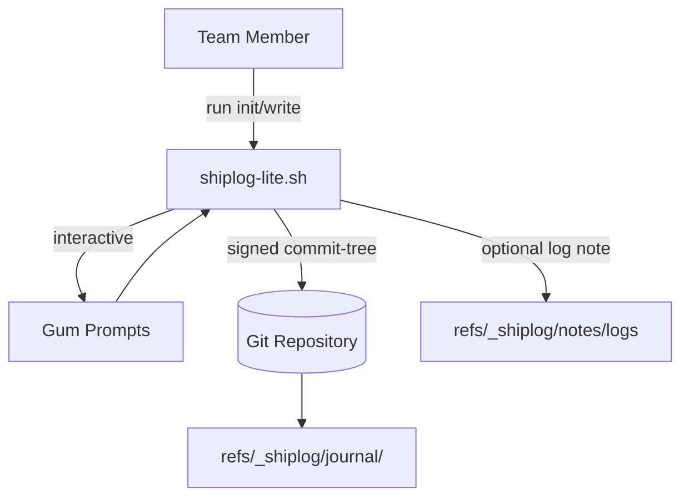

# SHIPLOG Lite

Minimal bash-based prototype for recording deployment events inside a Git repository. Entries are stored under hidden refs so they can be synced and audited without touching the main branch history.

## Requirements

- Bash 5+
- `git` with commit signing configured (GPG or SSH allowed signers)
- [`gum`](https://github.com/charmbracelet/gum) for interactive prompts
- `jq` (optional) for JSON exports

## Features

- Hidden refs under `refs/_shiplog/journal/<env>` for append-only journals
- Signed empty-tree commits via `git commit-tree -S`
- Optimistic fast-forward updates using `git update-ref`
- Optional NDJSON log attachments stored at `refs/_shiplog/notes/logs`
- Pretty `ls`, `show`, and `verify` flows powered by `gum`

## Architecture



Mermaid diagrams render on GitHub, Obsidian, and other markdown viewers with Mermaid support.

## Quick Start

```bash
chmod +x shiplog-lite.sh
./shiplog-lite.sh init
./shiplog-lite.sh write
```

Use `SHIPLOG_ENV` to target a specific environment (defaults to `prod`). For convenience you can symlink the script to `shiplog` and invoke it directly.

## Tooling Helpers

- Dependency installer: `install-shiplog-deps.sh` installs `gum` + `jq` with `--dry-run` and `--silent` flags.
  ```bash
  chmod +x install-shiplog-deps.sh
  ./install-shiplog-deps.sh
  ```
- Docker sandbox: `shiplog-sandbox.sh` builds the local Dockerfile and drops you into `/workspace` with the repo mounted.
  ```bash
  ./shiplog-sandbox.sh            # build + interactive shell
  ./shiplog-sandbox.sh ./shiplog-lite.sh ls prod 5
  ```
  Override the image tag with `SHIPLOG_SANDBOX_IMAGE`, and SSH agent forwarding is wired in when `SSH_AUTH_SOCK` is set.

## Testing

- `make test` builds the dockerized Bats image with signing disabled and runs the suite locally.
- `make test-signing` builds with signing enabled (loopback GPG key) and runs the same tests against signed commits.
- GitHub Actions (`.github/workflows/ci.yml`) runs both variants on push and pull requests via Docker Buildx cache.

The Bats suite under `tests/` currently covers:
- init wiring (`refspecs` + `reflogs`) and empty journal behavior.
- non-interactive write flow + `ls`/`show` rendering (human+JSON trailer).
- `export-json` NDJSON, Git notes attachment, and fast-forward-only guardrails.
- `verify` author allowlist logic (unsigned + signed matrix legs).
- default `show` and the dedicated signed-commit verification path.

```mermaid
stateDiagram-v2
    [*] --> BuildUnsigned
    BuildUnsigned --> RunUnsigned
    RunUnsigned --> BuildSigned
    BuildSigned --> RunSigned
    RunSigned --> [*]

    note right of RunUnsigned: 
      make test
      (SHIPLOG_SIGN=0)
    note right of RunSigned: 
      make test-signing
      (loopback GPG)
```

## Environment Variables

- `SHIPLOG_ENV` – default environment for journal entries (default: `prod`).
- `SHIPLOG_AUTHOR_NAME` / `SHIPLOG_AUTHOR_EMAIL` – override author identity.
- `SHIPLOG_AUTHORS` – space-delimited allowlist; restricts authors permitted to append to the journal.
- `SHIPLOG_ALLOWED_SIGNERS` – path to SSH allowed signers file used during commit verification.
- `SHIPLOG_IMAGE` / `SHIPLOG_TAG` / `SHIPLOG_RUN_URL` / `SHIPLOG_LOG` – seed prompts for write flow and optional log attachments.
- `SHIPLOG_REF_ROOT` – override the ref namespace root (default: `refs/_shiplog`; set to e.g. `refs/shiplog` on Git builds that forbid dot-prefixed components).
- `SHIPLOG_NOTES_REF` – override the git-notes ref (default: `refs/_shiplog/notes/logs`).
- `SHIPLOG_SIGN` – set to `0`/`false` to skip commit signing (used in CI when no keys exist).
- `GUM` – path to the `gum` binary (default: `gum`).

## Project Layout

- `shiplog-lite.sh` – single-file MVP script.
- `install-shiplog-deps.sh` – cross-platform helper for installing gum + jq.
- `shiplog-sandbox.sh` – Docker sandbox launcher (builds `Dockerfile`).
- `Dockerfile` – Ubuntu-based sandbox with git, gum, jq preinstalled.
- `.gitignore` – excludes local-only artifacts.

## License

This project is currently unlicensed. All rights reserved.
