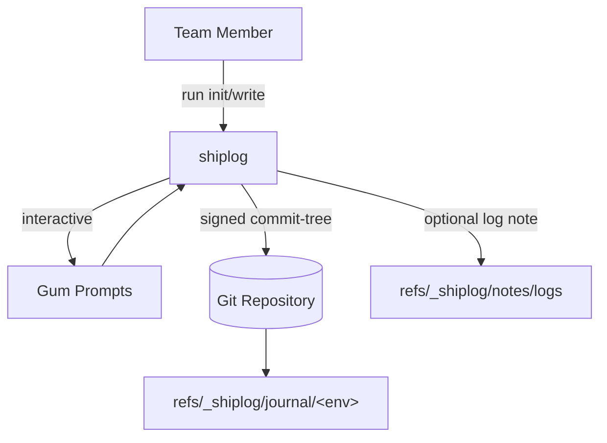
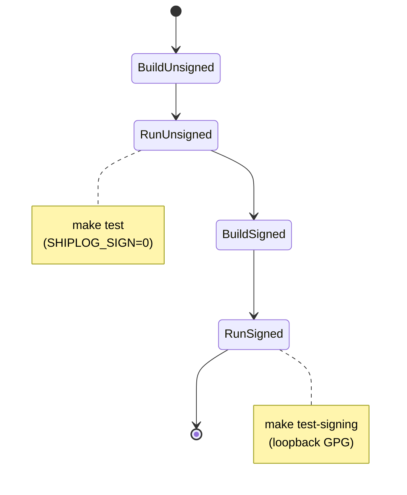
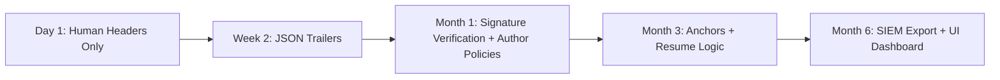

# 🚢 Shiplog

> **Your deployment black box recorder. Every release leaves a cryptographic receipt.**

<p align=\"center\"></p>

> [!WARNING]
> ## Project Status
> 🚧 **Experimental** — actively changing, expect breaking changes.

## Uh-oh! Oh boy. It hit the fan.

SMS? Alerting.  
Beepers? Beeping.  
Emails popping off.  
Dogs barking.  
Logs spewing.  
Intern looking like they just saw a ghost.

> **\"What changed?\"** — the first question during every incident.

We all know how it goes from here. You put on your Sherlock Holmes hat and start digging through Slack history, CI logs, and deployment dashboards, trying to reconstruct what happened. Was it the API deploy at 2pm? The hotfix at 4pm? Who approved these database migrations?

## But not today! You? Calm. Collected. Moisturized. In your lane. Unbothered. What's your secret? Shiplog, of course!

Shiplog creates a **tamper-proof audit trail** of every deployment, stored right in your Git repo:

```bash
$ git shiplog ls
Commit        Status   Service  Env   Author                 Date
def456a...    FAIL     api      prod  bob@example.com        2024-05-01
abc123f...    SUCCESS  web      prod  alice@example.com      2024-04-30
789beef...    REVERT   web      prod  alice@example.com      2024-04-29
```

You don't even have to leave the terminal to find out who, what, where, when, why, and how (WWWWWH).

### Use Shiplog For Future You

- **Human-readable** Helps when you're debugging at 3am.  
- **Machine-parseable** For your monitoring tools.  
- **Cryptographically signed** for compliance and clear provenance.  
- **Git-native** so it follows your code everywhere.

## What Makes SHIPLOG Different

Shiplog isn't another deployment platform — **it's a primitive you build on**.

Think `git commit` for deployments. It gives you the essential building block (cryptographic receipts) that you can use to build whatever workflows your team needs.


**Built on Git** means:

- Zero new infrastructure (no databases, no services)
- Distributed by default (works offline, syncs everywhere)  
- Tamper-evident (signed commits, append-only refs)
- Familiar tooling (`git log`, `git show`, etc.)

## Quick Start

```bash
# Install
# Verify the script first:
curl -fsSL https://shiplog.dev/install -o install-shiplog.sh
curl -fsSL https://shiplog.dev/install.sha256 -o install-shiplog.sh.sha256
sha256sum -c install-shiplog.sh.sha256
bash install-shiplog.sh

# Initialize in your repo
cd your-project
git shiplog init

# Record your first deployment
git shiplog write
# Non-interactive (CI):
# SHIPLOG_BORING=1 git shiplog --yes write
# or git shiplog --boring write

# View your deployment history  
git shiplog --env prod ls

# Export for your monitoring tools
git shiplog --env prod export-json | jq '.'
```

> Tip: Use `--yes` (or set `SHIPLOG_ASSUME_YES=1`) to auto-confirm prompts in automation.

That's it. You now have cryptographic deployment receipts.

## What You Can Build

Since Shiplog gives you reliable deployment events, you can build:

- **Incident response**
  > \"Show me everything that deployed in the last 4 hours\"
- **Compliance audits**
  > Cryptographic proof of who deployed what when
- **Deployment gates**
  > Require signatures from multiple people for prod
- **Rollback automation**
  > \"Revert to the last known good state\"
- **Change correlation**
  > \"Link deployments to error spikes automatically\"

## Architecture

Shiplog records deployment events inside a Git repository using hidden refs so they can be synced and audited without touching the main branch history.



### Git-Native Ship Log

Shiplog keeps records of who, what, where, when, why, and how deployments were made right in git, with the rest of your code. It maintains a journal of deployment events, writing them to an append-only, immutable tree in the repo under `refs/_shiplog/journal/<env>`.


## Core Features

- **Hidden refs** under `refs/_shiplog/journal/<env>` for append-only journals
- **Signed empty-tree commits** via `git commit-tree -S`
- **Optimistic fast-forward updates** using `git update-ref`
- **Optional NDJSON log attachments** stored at `refs/_shiplog/notes/logs`
- **Local guardrails**: author allowlist & signer precheck before creating entries
- **Pretty `ls`, `show`, and `verify` flows** powered by `gum`
- **`--boring` / `SHIPLOG_BORING=1` mode** for CI automation (no prompts, plain-text output)
- **`--yes` / `--auto-accept` / `SHIPLOG_ASSUME_YES=1`** to auto-confirm prompts in non-interactive pipelines
- **Auto-push** of updated `_shiplog/*` refs (and notes) to `origin` by default; override with `--no-push` or `SHIPLOG_AUTO_PUSH=0`

## Real Deployment Entry

```bash
Deploy: web v2.1.3 → prod-us-west-2/frontend
Reason: Hotfix checkout cart failing (OPS-7421)  
Status: SUCCESS (2m15s)
Author: alice@company.com
Artifact: ghcr.io/yourorg/web:v2.1.3@sha256:abc123...
```

Plus JSON metadata for tooling:

```json
{
  \"env\": \"prod\",
  \"service\": \"web\", 
  \"status\": \"success\",
  \"who\": {\"name\": \"Alice\", \"email\": \"alice@company.com\"},
  \"what\": {\"artifact\": \"ghcr.io/yourorg/web:v2.1.3\"},
  \"where\": {\"region\": \"us-west-2\", \"cluster\": \"prod-1\"},
  \"why\": {\"reason\": \"Hotfix checkout cart\", \"ticket\": \"OPS-7421\"},
  \"when\": {\"start\": \"2025-09-20T14:30:00Z\", \"duration\": \"2m15s\"},
  \"how\": {\"pipeline\": \"github-actions\", \"run_url\": \"https://...\"}
}
```

## Core Commands

| Command | Purpose | Example |
|---------|---------|---------|
| `git shiplog init` | Setup refspecs & reflog configs | `git shiplog init` |
| `git shiplog write` | Record a deployment | `git shiplog write` |
| `git shiplog ls` | List recent entries | `git shiplog ls prod` |
| `git shiplog show` | Show entry details | `git shiplog show abc123f` |
| `git shiplog verify` | Check signatures | `git shiplog --env prod verify` |
| `git shiplog export-json` | Export for tooling | `git shiplog --env prod export-json \\| jq '.'` |

## Configuration & Policy

### Policy-as-Code

Keep policy in Git, in a signed ref, and mirror it into the working tree so humans can review it.

- **Canonical policy ref** – store the enforced policy under `refs/_shiplog/policy/current`. The ref points at a signed commit whose tree contains `.shiplog/policy.json`.
- **Working copy mirror** – keep the same file (`./.shiplog/policy.json`) on your main branch so policy edits go through normal PR review.
- **Starter template** – copy `examples/policy.json` into `.shiplog/policy.json` when bootstrapping a repo.
- **CI publisher** – after merge, run `scripts/shiplog-sync-policy.sh` to publish the reviewed file to the policy ref (fast-forward only, signed by the bot key).

### Example Policy File

`.shiplog/policy.json` (mirrored exactly into `refs/_shiplog/policy/current`):

```json
{
  \"version\": 1,
  \"require_signed\": true,
  \"allow_ssh_signers_file\": \".git/allowed_signers\",
  \"authors\": {
    \"default_allowlist\": [
      \"deploy-bot@ci\",
      \"james@flyingrobots.dev\"
    ],
    \"env_overrides\": {
      \"prod\": [
        \"deploy-bot@ci\",
        \"james@flyingrobots.dev\"
      ]
    }
  },
  \"deployment_requirements\": {
    \"prod\": {
      \"require_ticket\": true,
      \"require_service\": true,
      \"require_where\": [
        \"cluster\",
        \"region\",
        \"namespace\"
      ]
    },
    \"default\": {
      \"require_ticket\": false
    }
  },
  \"ff_only\": true,
  \"notes_ref\": \"refs/_shiplog/notes\",
  \"journals_ref_prefix\": \"refs/_shiplog/journal/\",
  \"anchors_ref_prefix\": \"refs/_shiplog/anchors/\"
}
```

### Local Configuration Overrides

Developers can customise via Git config while iterating:

```bash
git config shiplog.policy.allowedAuthors \"deploy-bot@ci you@example.com\"
git config shiplog.policy.requireSigned true
git config shiplog.policy.allowedSignersFile .git/allowed_signers
```

## Security Model

- **Signed commits** provide cryptographic receipts
- **Author allowlists** restrict who can record deployments  
- **Fast-forward only** prevents history rewriting
- **Policy enforcement** via Git hooks on your server
- **Server-side enforcement** via pre-receive hooks (sample in `contrib/hooks/pre-receive.shiplog`)

## Installation

### Quick Install

```bash
# Bootstrap helper
curl -fsSL https://raw.githubusercontent.com/flyingrobots/shiplog/main/scripts/install-shiplog.sh | bash
```

### Manual Installation

1. Clone the repository:
   ```bash
   git clone https://github.com/flyingrobots/shiplog.git \"$HOME/.shiplog\"
   ```
   
2. Update your shell configuration (`~/.bashrc`, `~/.zshrc`, etc.):
   ```bash
   export SHIPLOG_HOME=\"$HOME/.shiplog\"
   export PATH=\"$SHIPLOG_HOME/bin:$PATH\"
   ```
   
3. Reload your shell and verify: `git shiplog --help`

4. Install dependencies:
   ```bash
   \"$SHIPLOG_HOME/install-shiplog-deps.sh\"
   ```

If you reinstall into an existing repository, the installer issues `git fetch origin "refs/_shiplog/*:refs/_shiplog/*"` so your local journal history stays in sync.

### Uninstall

Run the bundled helper to remove Shiplog and restore your Git/Git config:

```bash
$SHIPLOG_HOME/scripts/uninstall-shiplog.sh
```

Use `--dry-run` to preview changes or `--profile` to target a specific shell profile. The uninstaller removes Shiplog's `_shiplog/*` refspecs, PATH/profile entries, and any `git-shiplog` / `shiplog` shims.
Remote refs under `refs/_shiplog/*` are left untouched so history remains auditable—prune them manually only if you truly intend to delete records.

## Requirements

- **Git 2.x+**
- **Bash 3.2+** shell  
- **`jq`** for JSON processing
- **`gum`** for interactive prompts (skip with `--boring`/`SHIPLOG_BORING=1`)
- **GPG or SSH signing key** (optional, for cryptographic receipts)

## Environment Variables

- `SHIPLOG_ENV` – default environment for journal entries (default: `prod`)
- `SHIPLOG_AUTHOR_NAME` / `SHIPLOG_AUTHOR_EMAIL` – override author identity
- `SHIPLOG_AUTHORS` – space-delimited allowlist; restricts authors permitted to append to the journal
- `SHIPLOG_ALLOWED_SIGNERS` – path to SSH allowed signers file used during commit verification
- `SHIPLOG_IMAGE` / `SHIPLOG_TAG` / `SHIPLOG_RUN_URL` / `SHIPLOG_LOG` – seed prompts for write flow and optional log attachments
- `SHIPLOG_STATUS` – pre-select deployment status (defaults to `success` when interactive)
- `SHIPLOG_SIGN` – set to `0`/`false` to skip commit signing (used in CI when no keys exist)
- `SHIPLOG_BORING` – set to `1` to disable gum UI globally (same as `--boring`)
- `SHIPLOG_ASSUME_YES` – set to `1` to auto-confirm prompts even when gum is available (same as passing `--yes` / `--auto-accept`)
- `SHIPLOG_AUTO_PUSH` – set to `0` to skip automatic `git push` of updated `_shiplog/*` refs (use `--no-push` on the CLI for one-off runs)

Use `SHIPLOG_ENV` to target a specific environment (defaults to `prod`).

## Testing

- `make test` builds the dockerized Bats image with signing disabled and runs the suite locally
- `make test-signing` builds with signing enabled (loopback GPG key) and runs the same tests against signed commits
- GitHub Actions (`.github/workflows/ci.yml`) runs both variants on push and pull requests via Docker Buildx cache
- To verify the pre-receive hook logic without touching a real remote, run `bats test/11_pre_receive_hook.bats`



## Makefile

- `make build` compiles the local Docker image without executing the suite.
- `make test` rebuilds when necessary and runs the unsigned tests inside Docker.
- `make build-signing` / `make test-signing` repeat the flow with `ENABLE_SIGNING=true` for GPG-backed runs.
- Always use these targets (or GitHub Actions) so tests execute inside containers rather than on the host.

## Tooling Helpers

- **Dependency installer**: `install-shiplog-deps.sh` installs `gum` and `jq` with `--dry-run` and `--silent` flags
- **Docker sandbox**: `shiplog-sandbox.sh` builds the local Dockerfile and drops you into `/workspace` with the repo mounted (git, gum, jq, bats)
- **VS Code Dev Container**: open the repository in VS Code and run \"Dev Containers: Reopen in Container\" to get a ready-to-go environment
- **Uninstaller**: `scripts/uninstall-shiplog.sh` removes PATH/profile entries, `_shiplog/*` refspecs, and CLI shims (supports `--dry-run` and `--profile`)

## Project Layout

- `bin/git-shiplog` – entrypoint CLI sourcing the `lib/` helpers (invoked via `git shiplog`)
- `lib/` – bash modules (`common`, `git`, `policy`, `commands`)
- `scripts/` – plumbing helpers (e.g. `shiplog-sync-policy.sh`)
- `test/` – Bats suite (interactive + boring modes) and fixtures
- `install-shiplog-deps.sh` – cross-platform helper for installing gum and jq
- `shiplog-sandbox.sh` – Docker sandbox launcher (builds `Dockerfile`)
- `examples/policy.json` – starter policy file for `.shiplog/policy.json`
- `contrib/README.md` – notes on hooks and CI helpers (`hooks/pre-receive.shiplog`)

## Roadmap

<!-- <progress_bar> -->
### `v1.0.0` Progress
```text
███████████████████▓░░░░░░░░░░░░░░░░░░░ 48%
```
<!-- </progress_bar> -->

### Completed Features

The following features are finished, tested, and documented.

- Append-only journals under `refs/_shiplog/journal/<env>` recorded via `git shiplog write`.
- Policy-aware prompts and boring mode with allowlist + signing prechecks.
- Rich `git shiplog ls`/`show` views with gum UI, plain fallbacks, and note streaming.
- `git shiplog verify` signature + author enforcement with configurable policy sources.
- `git shiplog export-json` NDJSON pipeline for downstream automation.
- Dockerized Bats suite and sample pre-receive hook for server-side guardrails.

### Planned Features

The following features have been planned, but not started yet.

- Replace gum UI dependencies with the bundled `scripts/bosun` toolkit.
- Add `--limit` and richer filtering for listing commands.
- Publish a signed Approved Authors manifest and verification workflow.
- Multi-author signature requirements for sensitive environments.
- Anchor/resume logic and SIEM export pipelines for long-lived journals.

### WIP

The following features are currently being worked on.

- Expand docs under `docs/features/` to cover every shipped command.
- Continue aligning CLI ergonomics (e.g., `--env` global flag) with user expectations.
- Iterate on Docker test harness performance and signed-build coverage.
- Harden policy publishing automation (`scripts/shiplog-sync-policy.sh`).

<!-- <features_table> -->
| Feature | Description | Planned? | Started? | Finished? | Code | Tests | Documentation | Remarks |
|---------|-------------|----------|----------|-----------|------|-------|---------------|---------|
| Journaling bootstrap | Configure hidden refspecs and reflogs via `git shiplog init` | Yes | Yes | Yes | lib/commands.sh:3 | test/01_init_and_empty_ls.bats:12 | docs/features/init.md | Sets up fetch/push for refs/_shiplog/* |
| Deployment write flow | Interactive/boring write path with policy enforcement | Yes | Yes | Yes | lib/commands.sh:15 | test/02_write_and_ls_show.bats:22 | docs/features/write.md | Signs empty-tree commits and attaches logs |
| Listing & detail views | `git shiplog ls` and `git shiplog show` render journal entries | Yes | Yes | Yes | lib/git.sh:141 | test/02_write_and_ls_show.bats:31 | docs/features/ls.md | Gum UI with plain fallbacks |
| Verification tooling | Author + signature checks through `git shiplog verify` | Yes | Yes | Yes | lib/commands.sh:107 | test/05_verify_authors.bats:22 | docs/features/verify.md | Honors policy ref + git config |
| JSON export | NDJSON output for downstream automation | Yes | Yes | Yes | lib/commands.sh:132 | test/03_export_json_ndjson.bats:11 | docs/features/export-json.md | Adds commit SHA metadata |
| Policy resolution | Surfacing effective policy with `git shiplog policy` | Yes | Yes | In progress | lib/policy.sh:3 | test/09_policy_resolution.bats:25 | docs/features/policy.md | Needs richer validation UX |
| Notes attachments | Optional NDJSON log notes displayed in `git shiplog show` | Yes | Yes | Yes | lib/git.sh:52 | test/04_notes_attachment.bats:20 | docs/features/notes.md | Shares ref with journals |
<!-- </features_table> -->



## License

MIT © J. Kirby Ross

---

**SHIPLOG**: Because every deploy should leave a trace you can trust.

> **\"Trust but verify\"** — every deploy should leave a signature you can't lose.
