# 🚢 Shiplog

> **Your deployment black box recorder. Every release leaves a cryptographic receipt.**

<p align="center"></p>

> [!WARNING]
> ## Project Status
> 🚧 **Experimental** — actively changing, expect breaking changes.

## Uh-oh! Oh boy. It hit the fan.

SMS? Alerting.  
Beepers? Beeping.  
Emails popping off.  
Dogs barking.  
Logs spewing.  
Intern looking like they just saw a ghost.

> **"What changed?"** — the first question during every incident.

We all know how it goes from here. You put on your Sherlock Holmes hat and start digging through Slack history, CI logs, and deployment dashboards, trying to reconstruct what happened. Was it the API deploy at 2pm? The hotfix at 4pm? Who approved these database migrations?

## But not today! You? Calm. Collected. Moisturized. In your lane. Unbothered. What's your secret? Shiplog, of course!

Shiplog creates a **tamper-proof audit trail** of every deployment, stored right in your Git repo:

```bash
$ git shiplog ls --oneline
Shiplog Ledger
  sha     how           version  where          outcome       who     when
  ------- ------------- -------- -------------- ------------- ------- ------
  abc123f Deploy: web   v2.1.3 → prod-us-west-2 ✅ OK         alice   2h ago
> def456a Deploy: api   v1.4.2 → prod-us-west-2 ❌ FAIL       bob     6h ago 
  789beef Rollback: web v2.1.2 → prod-us-west-2 🔄 REVERT     alice   8h ago
  ======= ============= ======= =============== ============= ======= ======

[←↓↑→] navigate • [enter] submit • [d]iff • [c]heckout • [f]ilter
```

You don't even have to leave the terminal to find out who, what, where, when, why, and how (WWWWWH).

### Use Shiplog For Future You

- **Human-readable** Helps when you're debugging at 3am.  
- **Machine-parseable** For your monitoring tools.  
- **Cryptographically signed** for compliance and clear provenance.  
- **Git-native** so it follows your code everywhere.

## What Makes SHIPLOG Different

Shiplog isn't another deployment platform — **it's a primitive you build on**.

Think `git commit` for deployments. It gives you the essential building block (cryptographic receipts) that you can use to build whatever workflows your team needs.

```mermaid
gitGraph
  commit id: "feat: add auth" tag: "main"  
  commit id: "fix: handle errors"
  branch shiplog_prod
  commit id: "✅ web v2.1.3 → prod"
  commit id: "❌ api v1.4.2 → prod" 
  commit id: "🔄 rollback web v2.1.2"
```



**Built on Git** means:

- Zero new infrastructure (no databases, no services)
- Distributed by default (works offline, syncs everywhere)  
- Tamper-evident (signed commits, append-only refs)
- Familiar tooling (`git log`, `git show`, etc.)

## Quick Start

```bash
# Install
curl -fsSL https://shiplog.dev/install | bash

# Record your first deployment
git shiplog start --env "prod" --service "web"

# View your deployment history  
git shiplog ls --env "prod"

# Export for your monitoring tools
git shiplog export-json --env prod | jq '.'
```

That's it. You now have cryptographic deployment receipts.

## What You Can Build

Since Shiplog gives you reliable deployment events, you can build:

- **Incident response**
  > "Show me everything that deployed in the last 4 hours"
- **Compliance audits**
  > Cryptographic proof of who deployed what when
- **Deployment gates**
  > Require signatures from multiple people for prod
- **Rollback automation**
  > "Revert to the last known good state"
- **Change correlation**
  > "Link deployments to error spikes automatically"

## Real Deployment Entry

```bash
Deploy: web v2.1.3 → prod-us-west-2/frontend
Reason: Hotfix checkout cart failing (OPS-7421)  
Status: SUCCESS (2m15s)
Author: alice@company.com
Artifact: ghcr.io/yourorg/web:v2.1.3@sha256:abc123...
```

Plus JSON metadata for tooling:

```json
{
  "env": "prod",
  "service": "web", 
  "status": "success",
  "who": {"name": "Alice", "email": "alice@company.com"},
  "what": {"artifact": "ghcr.io/yourorg/web:v2.1.3"},
  "where": {"region": "us-west-2", "cluster": "prod-1"},
  "why": {"reason": "Hotfix checkout cart", "ticket": "OPS-7421"},
  "when": {"start": "2025-09-20T14:30:00Z", "duration": "2m15s"},
  "how": {"pipeline": "github-actions", "run_url": "https://..."}
}
```

## Core Commands

| Command | Purpose | Example |
|---------|---------|---------|
| `git shiplog write` | Record a deployment | `git shiplog write` |
| `git shiplog ls` | List recent entries | `git shiplog ls --env prod --limit 10` |
| `git shiplog show` | Show entry details | `git shiplog show abc123f` |
| `git shiplog verify` | Check signatures | `git shiplog verify --env prod` |
| `git shiplog export-json` | Export for tooling | `git shiplog export-json \| jq '.'` |

## Security Model

- **Signed commits** provide cryptographic receipts
- **Author allowlists** restrict who can record deployments  
- **Fast-forward only** prevents history rewriting
- **Policy enforcement** via Git hooks on your server

## Requirements

- Git 2.x+
- Bash shell  
- `jq` for JSON processing
- `gum` for interactive prompts
- GPG or SSH signing key (optional, for cryptographic receipts)

## Installation

```bash
# Quick install
curl -fsSL https://raw.githubusercontent.com/flyingrobots/shiplog/main/scripts/install-shiplog.sh | bash
```

Or clone and run

```bash
git clone https://github.com/flyginrobots/shiplog
cd shiplog && ./install.sh
```

## Testing

```bash  
make test          # Run basic tests
make test-signing  # Test with GPG signatures enabled
```

## License

MIT © J. Kirby Ross

---

**SHIPLOG**: Because every deploy should leave a trace you can trust.
