# 🚢 SHIPLOG

**Who shipped what, when, where, why, and how — signed and append-only.** 

SHIPLOG is your deployment black box recorder: a ledger built on Git.  
Every release leaves a receipt. No guesswork. No mystery deployments. Just truth you can prove.

## 🔍 Why SHIPLOG Exists

- Incidents = less “what changed?” scrambling  
- Audits = clean provenance for deploys  
- Compliance = cryptographic receipts  
- Team alignment = everyone knows exactly what happened  

## 🛠️ How It Works

- Hidden refs under `_shiplog`: `refs/_shiplog/journal/<env>` & `refs/_shiplog/anchors/<env>`  
- Each deploy produces a **signed**, **empty-tree commit** with human-readable header + optional JSON trailer  
- Fast-forward-only ref writes, no history rewriting  
- Optional logs attached via `git notes` (`refs/notes/_shiplog/logs`)  

```mermaid
gitGraph
  commit id: "code commit A"
  commit id: "code commit B"
  branch shiplog/prod
  commit id: "deploy: web v1.0 → prod ✅"
  commit id: "deploy: web v1.1 → prod ❌"
  commit id: "rollback to v1.0"
```



## **🚀 Quickstart (MVP)**

```bash
# Clone or create your repo
git init my-project
cd my-project
git commit --allow-empty -m "init"

# Setup
curl -fsSL https://example.com/shiplog-lite.sh -o shiplog && chmod +x shiplog

# Record a deploy
export SHIPLOG_ENV=prod
export SHIPLOG_SERVICE=web
export SHIPLOG_REASON="Hotfix: checkout cart failing"
export SHIPLOG_TICKET="OPS-7421"
export SHIPLOG_REGION="us-west-2"
export SHIPLOG_CLUSTER="prod-1"
export SHIPLOG_NAMESPACE="frontend"
export SHIPLOG_IMAGE="ghcr.io/yourorg/web"
export SHIPLOG_TAG="v2.1.3"
export SHIPLOG_RUN_URL="https://ci.example.com/runs/12345"

./shiplog write

# Inspect history
./shiplog ls --env prod
./shiplog show $(git rev-parse refs/_shiplog/journal/prod)

# Export JSON for external tools
./shiplog export-json --env prod | jq .
```

## **⚙Commands**

|**Command**|**Description**|**Example**|
|---|---|---|
|shiplog init|Setup refspecs & reflog configs|shiplog init|
|shiplog write|Append a deploy entry|see “Record a deploy” above|
|shiplog ls|List recent entries|shiplog ls --env prod --limit 20|
|shiplog show|Show details of one entry|shiplog show <commit>|
|shiplog verify|Check signatures + author allowlist|shiplog verify --env prod|
|shiplog export-json|Machine-readable output|`shiplog export-json|

## **Security & Audit Model**

- **Signatures required**: use your GPG / SSH signing key
- **Author allowlist**: restrict who can write entries
- **Fast-forward only**: no rewriting history; overrides are explicit entries
- **Anchors**: refs/_shiplog/anchors/<env> mark last good state

## **Migration Path**


## **Real-World Example**

```bash
Deploy: web v2.1.3 → prod-us-west-2/frontend
Reason: Hotfix checkout-cart failing (OPS-7421)
Status: SUCCESS (2m15s)
Author: alice@company.com
Repo:   7a8b9c1
Artifact: ghcr.io/yourorg/web:v2.1.3
```

And JSON trailer:

```json
{
  "env": "prod",
  "ts": "2025-09-19T22:31:07Z",
  "who": {"name":"Alice","email":"alice@company.com"},
  "what": {
    "service":"web",
    "repo_head":"7a8b9c1",
    "artifact":"ghcr.io/yourorg/web:v2.1.3"
  },
  "where": {
    "region":"us-west-2",
    "cluster":"prod-1",
    "namespace":"frontend"
  },
  "why": {
    "reason":"Hotfix checkout-cart failing",
    "ticket":"OPS-7421"
  },
  "how": {
    "run_url":"https://ci.example.com/runs/67890"
  },
  "status":"success"
}
```

## **Tests (Running Locally or in Docker)**

```bash
# Build the test image
make build

# Run tests without signing (faster)
make test

# Run tests with signing enabled
make test-signing
```

## **Requirements**

- Git >= 2.x
- Bash shell
- gum (for nicer prompts / display)
- jq (for JSON export)
- Optional: GPG / SSH key for signing (for production / audit mode)

## **License**

MIT © J. Kirby Ross
