# SHIPLOG • 🚢🪵

The pager goes off at 3:17 a.m. The intern is frozen, hands hovering over the keyboard like it’s wired with C4. And of course, you picked this week to quit smoking.

The dashboards are bleeding red.
Slack is twelve parallel arguments, all noise, no answers.

The monitoring alert reads like a ransom note — all caps, no punctuation, and somehow it knows your name. The runbook is 400 pages long. Step one: panic.

Bob mutters, “It worked on my laptop.” Bob’s laptop hasn’t been patched since the Obama administration.

The Jira ticket’s still “In Review.” That’s funny, because prod isn’t.

The CI logs stop mid-sentence. Last line: “Deploying…” Nothing else. Just static.

And in the corner, Jenkins is whispering again. He’s been mumbling the same cronjob lullaby since 2019. Nobody listens until prod catches fire, and suddenly the old man’s a suspect.

Stop blaming the ghost. Stop digging through rubble.

All of the ship is logged in Git.

Zero infra. No new tools. Lives by your code. No archaeology. No copy/paste. No 2FA hopscotch through three dashboards.

Just clarity. And the truth.

*INT. WAR ROOM – DAWN*

The intern finally exhales, hands unclenched. Slack arguments dissolve into praise. Bob swears he’ll upgrade Jenkins — “just in case.”

Yeah, right.

The room is calm again. The intern looks at you, wide-eyed:

“How’d you figure it out so fast?”

You smirk, close the laptop, and say:

**“Simple. Get Shiplog.”**

## 🚢 What Is Shiplog?

Shiplog is your deployment black box recorder. Every release leaves a cryptographic receipt.

Treat it as an infrastructure primitive—wire it into deployment pipelines, CI/CD jobs, and automation. The CLI is available for local debugging, but the expectation is that Shiplog runs inside your scripted workflows rather than as a manual, ad-hoc tool.

### Use Shiplog for Future You

- **Human-readable**: Helps when you're debugging at 3 a.m.
- **Machine-parseable**: For your monitoring tools and dashboards.
- **Cryptographically signed**: For compliance and clear provenance.
- **Git-native**: It follows your code everywhere.

### What Makes Shiplog Different

Shiplog isn't another deployment platform, it's a primitive. Build with it. Think `git commit` for deployments. It gives you the essential building block (cryptographic receipts) that you can use to build whatever workflows your team needs.

Because it's built on Git, you get:

- **Zero new infrastructure**: No databases, no services.
- **Distributed by default**: It works offline and syncs everywhere.
- **Tamper-evident**: Signed commits and append-only refs prevent history rewriting.
- **Familiar tooling**: Use familiar commands like `git log` and `git show`.

```mermaid
gitGraph
  commit id: "feat: add auth" tag: "main"
  commit id: "fix: handle errors"
  branch reds/_shiplog/prod
  commit id: "✅ web v2.1.3 → prod"
  commit id: "❌ api v1.4.2 → prod"
  commit id: "🔄 rollback web v2.1.2"
```



## 🚀 Quickstart

There are a few ways to get started.

### Quick Install (Recommended)

> ⚠️ **Important:** Shiplog’s own workflows mutate Git repositories aggressively. Do **not** run `git shiplog …` inside this repository on your host; use the dev container or a disposable sandbox clone instead. See [docs/docker.md](docs/docker.md) for our container strategy.

1. Clone the repository:

```Bash
git clone https://github.com/flyingrobots/shiplog.git "$HOME/.shiplog"
```

2. Update your shell configuration (`~/.bashrc`, `~/.zshrc`, etc.):

```Bash
export SHIPLOG_HOME="$HOME/.shiplog"
export PATH="$SHIPLOG_HOME/bin:$PATH"
```

3. Reload your shell and verify: `git shiplog --help` and `git shiplog --version`

4. Install dependencies:

```Bash
"$SHIPLOG_HOME/install-shiplog-deps.sh"
```

## Setup Wizard (Recommended)

Use the built-in wizard to configure Shiplog for your repo — unsigned by default (Open/Balanced) or signed (Strict), including per-environment enforcement:

```bash
# Interactive
git shiplog setup

# Non-interactive (examples)
SHIPLOG_SETUP_STRICTNESS=balanced \
SHIPLOG_SETUP_AUTHORS="you@example.com teammate@example.com" \
git shiplog setup

SHIPLOG_SETUP_STRICTNESS=strict \
SHIPLOG_SETUP_STRICT_ENVS="prod" \
git shiplog setup

# Auto-push policy ref when origin is configured
SHIPLOG_SETUP_AUTO_PUSH=1 git shiplog setup
```

### Setup Modes

- Open: Unsigned by default for fast adoption.
- Balanced: Unsigned plus an author allowlist (provide emails).
- Strict: Require signatures globally or per-environment (e.g., prod only).

See docs/features/setup.md and docs/features/modes.md for details.

## Basic Usage

Once installed, you can initialize a repo and start recording deployments.

```Bash
# Initialize in your repo
cd your-project
git shiplog init

# Record your first deployment
export SHIPLOG_ENV=prod
export SHIPLOG_SERVICE=web
git shiplog write

# View your deployment history
git shiplog ls --env prod
git shiplog show $(git rev-parse refs/_shiplog/journal/prod)

# Non-interactive (CI) mode
# Use `SHIPLOG_BORING=1` to disable interactive prompts
SHIPLOG_BORING=1 git shiplog write

# Export for your monitoring tools
git shiplog export-json --env prod | jq '.'

## Release with Shiplog (MVP)

Dogfood Shiplog to release Shiplog itself:

- Bootstrap trust once (signed `refs/_shiplog/trust/root`), then publish `.shiplog/policy.json` to `refs/_shiplog/policy/current`.
- Sync the signer roster locally: `./scripts/shiplog-trust-sync.sh`.
- Capture build/test logs, then write the entry with environment variables and `SHIPLOG_LOG`.
- Push the journal ref (e.g., `refs/_shiplog/journal/prod`) and let the server hook enforce policy and signatures.

See `docs/runbooks/release.md`:1 for the full step‑by‑step, common failures, and a CI outline.
```

## 🛠️ How It Works

Shiplog records deployment events as signed empty-tree commits to a set of hidden Git refs. This makes the ledger tamper-evident and keeps it separate from your main branch history.

- Journals: `refs/_shiplog/journal/<env>` are append-only, fast-forward only logs for each environment.
- Anchors: `refs/_shiplog/anchors/<env>` can be used to mark a last known good state.
- Notes: `refs/_shiplog/notes/logs` are optional NDJSON attachments for logs or other metadata.

See docs/features/modes.md:1 for how to run unsigned by default, enable signing via policy, and switch back and forth without rewriting history.

## ⚙️ Core Commands

| Command | Purpose | Example |
| :--- | :--- | :--- |
| `git shiplog init` | Setup refspecs & reflog configs | `git shiplog init` |
| `git shiplog write` | Record a deployment | `git shiplog write` |
| `git shiplog ls` | List recent entries | `git shiplog ls --env prod --limit 5` |
| `git shiplog show` | Show entry details | `git shiplog show <commit>` |
| `git shiplog verify` | Check signatures + author allowlist | `git shiplog verify --env prod` |
| `git shiplog export-json` | NDJSON export for external tools | `git shiplog export-json \| jq '.'` |

## 🔐 Security & Policy

Shiplog's security model is based on policy-as-code, stored and enforced within Git itself.

### Policy Lives in Git Itself

- **Canonical ref**: `refs/_shiplog/policy/<env>` are signed commits containing your `.shiplog/policy.yaml` files.
- **Mirror in main branch**: A copy of the policy file lives on your `main` branch, allowing changes to go through the normal PR review process.
- **CI sync script**: A script (`scripts/shiplog-sync-policy.sh`) fast-forwards the policy ref after a merge, ensuring the enforced policy is always what's been reviewed and approved.

Signing is opt‑in by default. Enable it by setting `require_signed: true` in your policy or export `SHIPLOG_SIGN=1` for a single session. When unsigned, the server hook can still enforce fast-forward and author allowlists depending on your setup. For switching guidance, see docs/runbooks/toggle-signing.md:1.
### Example Policy File (`.shiplog/policy.json`)

```JSON
{
  "version": 1,
  "require_signed": true,
  "allow_ssh_signers_file": ".git/allowed_signers",
  "authors": {
    "default_allowlist": [
      "deploy-bot@ci",
      "james@flyingrobots.dev"
    ],
    "env_overrides": {
      "prod": [
        "deploy-bot@ci",
        "james@flyingrobots.dev"
      ]
    }
  },
  "deployment_requirements": {
    "prod": {
      "require_ticket": true,
      "require_service": true,
      "require_where": [
        "cluster",
        "region",
        "namespace"
      ]
    },
    "default": {
      "require_ticket": false
    }
  },
  "ff_only": true,
  "notes_ref": "refs/_shiplog/notes",
  "journals_ref_prefix": "refs/_shiplog/journal/",
  "anchors_ref_prefix": "refs/_shiplog/anchors/"
}
```

## 🧪 Testing

Shiplog uses make and bats to run its test suite.

```Bash
# Unsigned (fast, CI-friendly)
make test

# Signed (loopback GPG key)
make test-signing
```

### Coverage:

- Init wiring (refspecs + reflogs)
- Write flow + ls/show rendering
- Export-JSON + notes attachments
- Verify logic across unsigned/signed entries
- Fast-forward-only guardrails

### Requirements

- Git ≥ 2.x (with signing configured)
- Bash 3.2+ shell
- jq for JSON processing
- GPG or SSH signing key
  
## License

MIT © J. Kirby Ross • [@flyingrobots](https://github.com/flyingrobots)

_Jenkins was not harmed in the making of this project._
